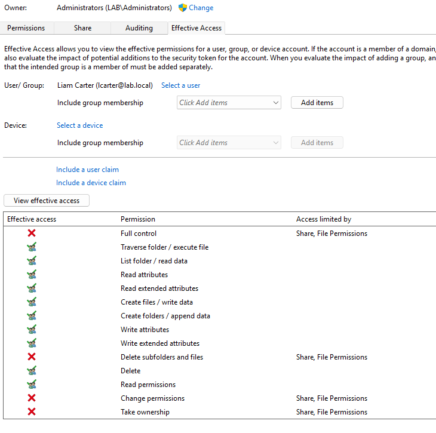
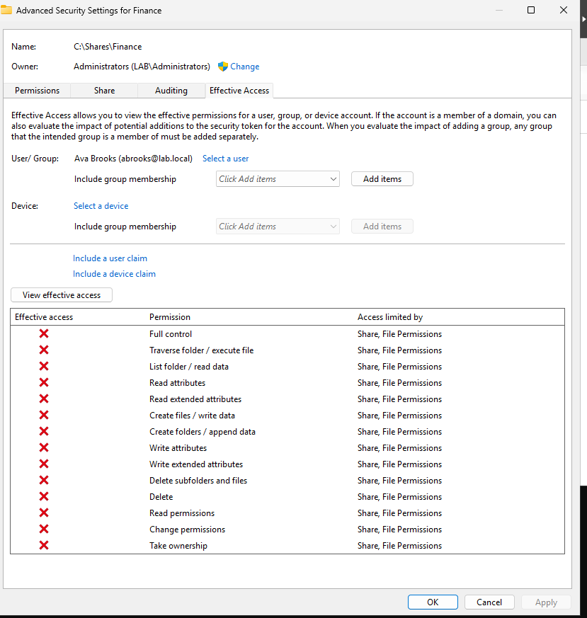
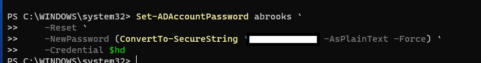
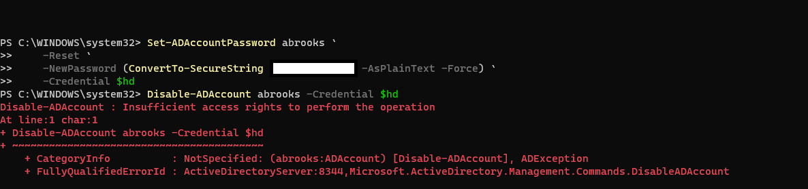
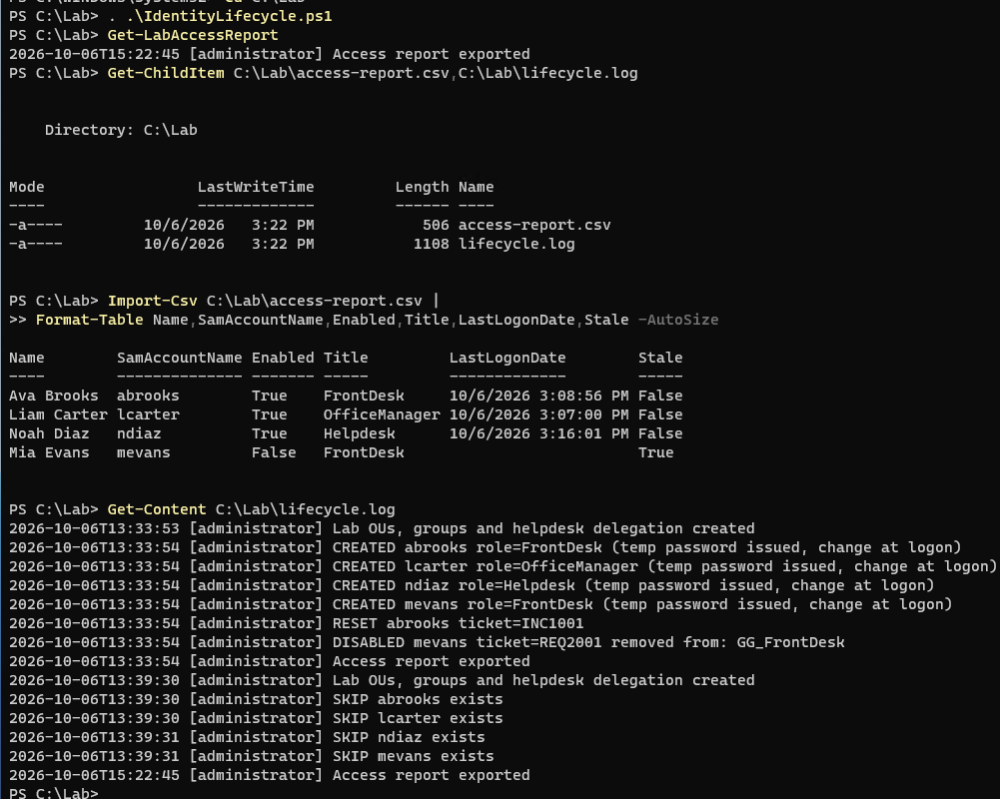
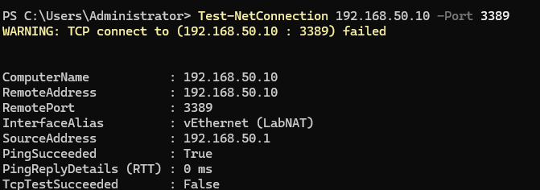
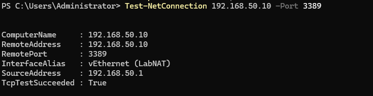

# Identity & Access Lifecycle Lab

A hands-on Windows Server identity administration lab built around **Active Directory, PowerShell, AGDLP, least privilege, access reviews, offboarding, and Tier 1 troubleshooting**.

This project demonstrates both the technical configuration and the support workflow behind a small enterprise identity environment.

## Highlights

- Built a Windows Server 2025 Active Directory domain: `lab.local`
- Automated joiner, password-reset, access-review, and leaver workflows with PowerShell
- Implemented AGDLP role-based access control
- Delegated Helpdesk password-reset/unlock rights without granting Domain Admin
- Built SMB resource groups and validated Effective Access
- Tested a real least-privilege boundary: password reset allowed, account disable denied
- Simulated and resolved an RDP/3389 firewall incident
- Generated an access-review CSV and lifecycle audit log
- Documented Microsoft 365 / Entra ID mailbox, MFA, SSO, RBAC, and leaver procedures
- Documented five support tickets with troubleshooting and escalation notes

## Lab architecture

```text
Windows 11 Pro Host
   |
   | Hyper-V / LabNAT 192.168.50.0/24
   |
   +-- DC01 - 192.168.50.10
       |-- Windows Server 2025
       |-- Active Directory Domain Services
       |-- DNS
       |-- Domain: lab.local
       |
       +-- OU=Lab
           |-- OU=Users
           |-- OU=Groups
           |-- OU=Disabled
```

## Identity and access model

The lab uses **AGDLP**:

```text
Accounts -> Global groups -> Domain Local groups -> Permissions
```

### Front Desk

```text
Ava Brooks
  -> GG_FrontDesk
     -> DL_Schedules_Read
        -> \\DC01\Schedules (Read)
```

### Office Manager

```text
Liam Carter
  -> GG_OfficeManager
     -> DL_Schedules_Read
     -> DL_Finance_Modify
        -> \\DC01\Finance (Modify)
```

### Helpdesk

```text
Noah Diaz
  -> GG_Helpdesk
     -> delegated reset/unlock rights on OU=Users
     -> no permission to disable accounts
```

## Verified lab evidence

### Finance access — Office Manager allowed

Liam Carter receives Finance access through `GG_OfficeManager -> DL_Finance_Modify`. He can read/write/modify data, but does not receive Full Control, ACL modification, or ownership rights.



### Finance access — Front Desk denied

Ava Brooks is intentionally excluded from the Finance resource group. Effective Access confirms that the Front Desk role cannot access the Finance share.



### Helpdesk delegated password reset succeeds

The Helpdesk credential can reset Ava Brooks' password using delegated rights.



### Helpdesk account disable is denied

Using the same Helpdesk credential, `Disable-ADAccount` fails with **Insufficient access rights to perform the operation**. This validates the least-privilege boundary.



### Access review and lifecycle logging

The access report records enabled state, role, last logon, group membership, and stale-account status. The lifecycle log records account creation, password reset, offboarding, and report generation without storing temporary passwords.



Live output files:
- [access-report.csv](sample-output/access-report.csv)
- [lifecycle.log](sample-output/lifecycle.log)

### RDP troubleshooting — failure isolated to TCP/3389

With the Remote Desktop firewall rule disabled, ICMP still succeeds but TCP/3389 fails. This isolates the problem away from general network connectivity.



### RDP troubleshooting — service restored

After re-enabling the Remote Desktop firewall rule, the same TCP/3389 test succeeds.



## PowerShell lifecycle automation

The main script is [IdentityLifecycle.ps1](IdentityLifecycle.ps1).

### Load the functions

```powershell
cd C:\Lab
. .\IdentityLifecycle.ps1
```

### Build the OU and group structure

```powershell
New-LabStructure
```

Creates:

```text
OU=Lab
├── OU=Users
├── OU=Groups
└── OU=Disabled
```

Role groups:

```text
GG_FrontDesk
GG_OfficeManager
GG_Helpdesk
```

Resource groups:

```text
DL_Schedules_Read
DL_Finance_Modify
```

### CSV-driven onboarding

Input file: [new-hires.csv](new-hires.csv)

```powershell
Add-LabUser
```

The function:
- Generates a unique `sAMAccountName`
- Creates the AD user
- Sets UPN, title, and office
- Places the user in `OU=Users`
- Assigns the appropriate role group
- Forces password change at first logon
- Writes lifecycle events to the audit log without logging passwords

### Helpdesk password reset

```powershell
Reset-LabPassword -Sam abrooks -Ticket INC1001
```

### Offboarding

```powershell
Disable-LabUser -Sam mevans -Ticket REQ2001
```

The leaver workflow:
1. Captures existing group memberships
2. Disables the AD account
3. Removes group memberships
4. Stamps the ticket/date/prior groups into the account description
5. Moves the account to `OU=Disabled`
6. Writes the action to the lifecycle log

### Access review

```powershell
Get-LabAccessReport
```

Exports `access-report.csv` with:
- Name
- sAMAccountName
- Enabled state
- Job role
- Creation date
- Last logon
- Group memberships
- 30-day stale-account flag

## SMB resource permissions

```powershell
New-SmbShare -Name Schedules -Path C:\Shares\Schedules `
  -FullAccess 'LAB\Domain Admins' `
  -ReadAccess 'LAB\DL_Schedules_Read'

New-SmbShare -Name Finance -Path C:\Shares\Finance `
  -FullAccess 'LAB\Domain Admins' `
  -ChangeAccess 'LAB\DL_Finance_Modify'
```

NTFS permissions are assigned to the **domain-local resource groups**, rather than directly to individual users.

## Support tickets

[tickets.md](tickets.md) documents:

| Ticket | Scenario | Outcome |
|---|---|---|
| INC1001 | Ava account lockout | Password reset + unlock |
| INC1003 | RDP unavailable | TCP/3389 isolated to Windows Firewall and restored |
| REQ2001 | Mia offboarding | Disabled, group access removed, moved to Disabled OU |
| REQ2002 | Liam needs Send As | Documented manager-approved Exchange workflow |
| REQ2003 | Ava requests Finance | Escalated because access falls outside Front Desk role |

The troubleshooting workflow is:

```text
Verify identity
    ->
Gather symptoms and scope
    ->
Confirm with data
    ->
Isolate root cause
    ->
Fix within permissions
    ->
Validate
    ->
Document or escalate
```

## Microsoft 365 / Entra ID runbook

[M365-Access-Runbook.md](M365-Access-Runbook.md) covers:

- Authentication vs. authorization
- MFA
- SSO
- Hybrid identity
- Entra administrative roles
- Azure RBAC
- Full Access
- Send As
- Send on Behalf
- Shared mailbox conversion
- Joiner/access-change/leaver checklists
- Least-privilege administration

The M365/Entra section is documented as a runbook; the on-premises AD, SMB access, Helpdesk delegation, reporting, and RDP portions were executed in the live lab.

## Security decisions

- Temporary passwords are not written to the lifecycle log.
- Public screenshots have test passwords redacted.
- Helpdesk receives delegated rights instead of Domain Admin.
- Resource permissions are granted through security groups rather than directly to users.
- Out-of-role requests are escalated rather than granted ad hoc.
- Leaver accounts are disabled before deletion to preserve auditability and references.

## Repository structure

```text
ad-identity-lifecycle-lab/
├── README.md
├── IdentityLifecycle.ps1
├── new-hires.csv
├── M365-Access-Runbook.md
├── tickets.md
├── FINISH-CHECKLIST.md
├── sample-output/
│   ├── access-report.csv
│   ├── lifecycle.log
│   └── README.md
└── screenshots/
    ├── 03-finance-effective-access-allowed.png
    ├── 04-finance-effective-access-denied.png
    ├── 05-helpdesk-reset-success-redacted.png
    ├── 06-helpdesk-disable-denied-redacted.png
    ├── 08-access-report.png
    ├── 09-rdp-port-failed.png
    ├── 10-rdp-port-passed.png
    └── README.md
```

## Interview talking points

**Why AGDLP?**  
It separates business-role membership from resource permissions. Users can move between roles without rebuilding ACLs, and access reviews remain readable.

**Why disable before delete?**  
Disabling immediately stops access while preserving the directory object and audit trail during the organization's retention/offboarding process.

**Why delegate Helpdesk rights instead of using Domain Admin?**  
It limits blast radius. A compromised Helpdesk credential can perform approved support actions without gaining control of the domain.

**Why was Ava's Finance request escalated?**  
Her Front Desk role does not map to the Finance resource group. Granting direct access would bypass the role model and violate least privilege.

**How was the RDP issue isolated?**  
The host still responded to ping while TCP/3389 failed. The RDP service was checked, the firewall rule was found disabled, and connectivity returned after the rule was re-enabled.

## Resume-ready bullets

**Identity & Access Lifecycle Lab | Active Directory, PowerShell, Microsoft 365, Entra ID**

- Built a Windows Server Active Directory domain and automated CSV-driven onboarding, password resets, access reviews, and offboarding with PowerShell and audit logging.
- Designed role-based access using AGDLP group nesting and delegated password-reset/unlock rights to a Helpdesk group, validating least privilege through successful and denied permission tests.
- Documented Microsoft 365 / Entra identity operations and resolved simulated identity/RDP/access tickets using a structured troubleshooting and escalation workflow.
